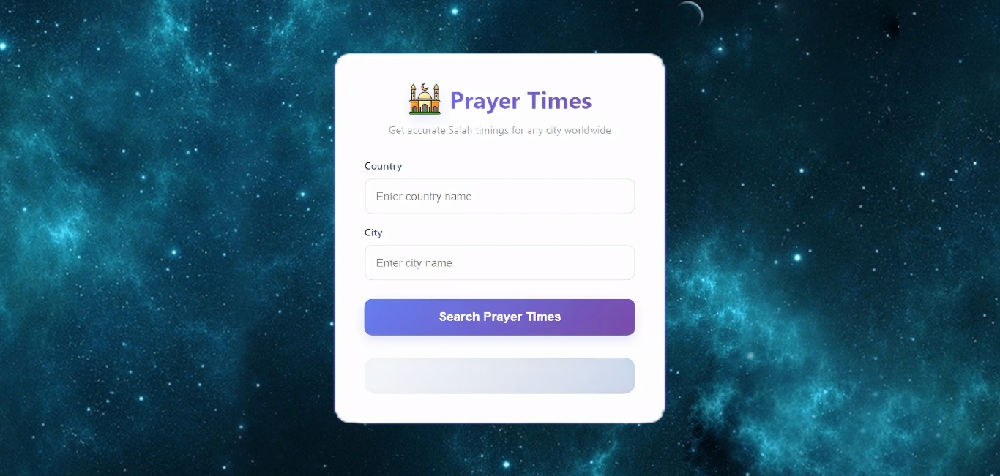

# 🕌 Dynamic-Salah-Engine (Global API Integration)

## 📸 App Interface

  

A high-performance, dynamic web application that provides real-time prayer timings for any city and country globally. This project showcases advanced _API handling_ using JavaScript Promises.

---

## 🚀 Live Links

- _🌐 Project Live Demo:_ [Click Here to View Live App](https://dynamic-salah-engine.vercel.app/)
- _💻 GitHub Repository:_ [View Source Code](https://github.com/hmahmd/dynamic-salah-engine)
- _📱 Contact Developer (WhatsApp):_ [Chat with Me Directly](https://wa.me/923112015969)

---

## 🌟 Key Features & API Logic

- _🌍 Global Search:_ Users can fetch accurate timings by entering any City and Country (e.g., UAE/Dubai or Pakistan/Karachi).
- _📡 Aladhan API Integration:_ Leverages the _Aladhan Prayer Times API_ to fetch authentic, location-based prayer data dynamically.
- _🔗 Promise-based Fetch:_ Implemented API calls using .then() for successful data retrieval and .catch() for robust error handling.
- _🛡️ Smart Filter & Validation:_ If fields are left empty, the app prevents a broken API call and prompts the user for input.
- _🎨 Glassmorphism UI:_ Features a sleek, modern interface with a purple-themed gradient and readable cards.

---

## 🛠️ Technical Breakdown

- _HTML5:_ Semantic structure for optimal accessibility.
- _CSS3:_ Custom gradients, Flexbox for layout, and responsive media queries.
- _JavaScript (ES6+):_ DOM Manipulation, .then()/.catch() Fetch pattern, and dynamic input handling.

---

---

## 👨‍💻 Developer Profile

_Hafiz Muhammad Ahmed_
Frontend Web Development Specialist
Dedicated to building clean, functional, and user-centric web solutions.
